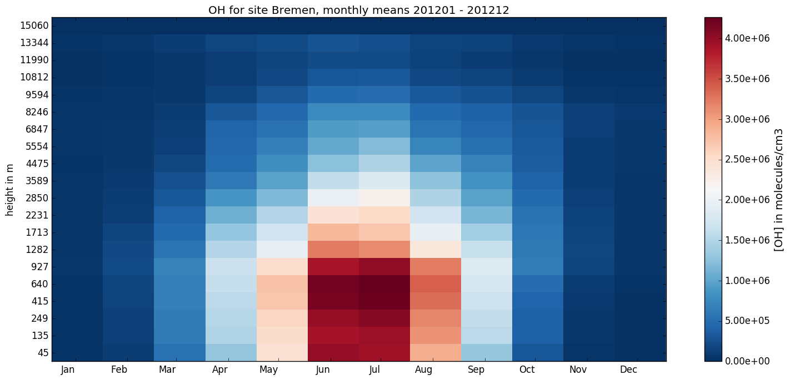

# Open Source EMEP/MSC-W model
Simplified access to the source code, input data and benchmark results

## Get the latest release dataset
```bash
# download the catalog tool/files
wget https://raw.githubusercontent.com/metno/emep-ctm/master/tools/catalog.py
wget https://raw.githubusercontent.com/metno/emep-ctm/master/tools/catalog.csv

# make it executable and run it
chmod +x catalog.py
catalog.py
```

## Get partial/older datasets
```
Usage: catalog.py [options]

Examples:

  Retrieve release dataset for revision REV (rv3|v201106|rv4_0|rv4_3|rv4_4|rv4_5|rv4_8)
    catalog.py -R REV          

  Get Only the source code and user guide for revision REV
    catalog.py -R REV -sd

  Download meteorological input for YEAR (2005|2008|2010..2013)
    catalog.py -Y YEAR -m


Options:
  --version             show program's version number and exit
  -h, --help            show this help message and exit
  -q, --quiet           don't print status messages to stdout
  -v, --verbose         Increase verbosity
  --catalog=CATALOG     Override dataset cataloque path/file
                        (default:./catalog.csv)

  Release options:
    Select a release dataset

    -R REV, --revision=REV
                        revision REV
    -Y YEAR, --year=YEAR
                        Meteorological/run YEAR

  Dataset options:
    Get parts of a release dataset

    -m, --meteo         get meteorology input
    -i, --input         get other input
    -o, --output        get model benckmark
    -s, --source        get source code for benckmark
    -d, --docs          get corresponding user guide
    --extras            also get the extras, if any

  Download options:
    --yes               Don't ask before start downloading/unpacking
    --outpath=OUTPATH   Override output (dataset) directory
    --tmppath=TMPPATH   Override temporary (download) directory
    --cleanup           Remove ALL temporary (download) files
```

# Tools to read sites and sondes output

The EMEP model currently provides detailed outputs for slected locations.
The 'sites' outputs provide surface concentrations (at ca. 3m),
and typically many (or all) chemical compounds are provided for each site and hour.
The 'sondes' type of outputs provide vertical profiles,
typically for a selection of compounds (to prevent huge files)
and possibly with time-resolution of e.g. 3 or 6 hours.
The model has historically provided ascii outputs,
but recently a parallel system with netcdf outouts has been introduced.
In future the ascii outputs will be removed.

We provide two programmes:

* Rd_ncsites.py:  python script to read and plot netcdf site files
* Rd_ncsondes.py: python script to read and plot netcdf sonde files

The codes have a number of things in common:

* they can be called either directly with site names and  pollutant, or
* they can be used in a simple menu-like approach in which case the user is
  presented with a list of stations, pollutants and other choices as appopriate.
* they produce ascii files for the desired sites and pollutants. 

The python scripts also produce plots, e.g. of daily or monthly mean
concenrations - as time-series for sites data, and as 2-D plots for
sonde data (see [Fig.1](#fig1)).  

## Rd_ncsites.py and Rd_ncsondes.py

These python tools make use of the matplotlib and netCDF4 modules - these are
usually readily available, e.g. in standard Ubuntu repositories.

<a name="fig1"></a>

*Figure 1: Example of Rd_ncsondes.py output, monthly mean PAN values*

### Examples

```bash
# produces help with usage information
Rd_ncsondes.py -h

# suggest list of sites and then pollutants
# generate outputs after selection
Rd_ncsondes.py -i sondes_2012.nc

# produce ascii outputs and plot    
Rd_ncsondes.py -i sondes_2012.nc -s Bremen -v O3 -pt monmeans -pr entire
```

The ascii output files are prefixed with SITES or SONDES, for example:

* `SITES_Birkenes_O3.vals`:
  Hourly values as 24 column matrix
* `SITES_Birkenes_O3.dates`:
  Just lists dates (yyyy mm dd jday), same number of records as dmean, dmax below
* `SITES_Birkenes_O3.hrly`:
  Hourly values (with date info)
* `SITES_Birkenes_O3.dmean`:
  Daily means  (no dates)
* `SITES_Birkenes_O3.dmax`:
  Daily max  (no dates)
