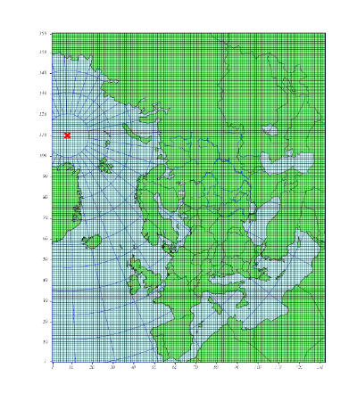

# The EMEP/MSC-W Model<br> unofficial User's Guide
September 2016


# Welcome to EMEP

This guide gives a brief documentation of the EMEP/MSC-W model version
rv4.10. It is intended primarily as a guide on how to run the model, and
to help users wishing to understand or change the model in terms of
domains, outputs, chemistry, etc.

The main documentation for the EMEP/MSC-W model is an article published
in Atmospheric Chemistry and Physics in 2012. This article will be
referred to as Simpson et al. (2012) in this manual.

-   Simpson, D., Benedictow, A., Berge, H., Bergström, R., Emberson,
    L.D., Fagerli, H., Flechard, C.R., Hayman, G.D., Gauss, M., Jonson,
    J.E., Jenkin, M.W., Nyíri, Á, Richter, C., Semeena, V.S, Tsyro, S.,
    Tuovinen, J.-P., Valdebenito, Á., and Wind, P.: The EMEP MSC-W
    chemical transport model – technical description. Atmospheric
    Chemistry and Physics, 12, 7825-7865, 2012.</br>
    <http://www.atmos-chem-phys.net/12/7825/2012/acp-12-7825-2012.html>

The model source code is available from the Open Source EMEP/MSC-W model
github page:</br>
<https://github.com/metno/emep-ctm>

## Licenses and Caveats

The EMEP code is provided under the GNU General Public License version 3
(<http://fsf.org> and/or <http://www.gnu.org/copyleft/gpl.html>).

Each code module is prefaced with something like:
```
! <EXAMPLE_CODE.f90 - A component of the EMEP MSC-W  Eulerian
!          Chemical transport Model>
!*******************************************************************!
!*
!*  Copyright (C) 2007-2016 met.no
!*
!*  Contact information:
!*  Norwegian Meteorological Institute
!*  Box 43 Blindern
!*  0313 OSLO
!*  NORWAY
!*  email: emep.mscw@met.no
!*
!*    This program is free software: you can redistribute it and/or modify
!*    it under the terms of the GNU General Public License as published by
!*    the Free Software Foundation, either version 3 of the License, or
!*    (at your option) any later version.
!*
!*    This program is distributed in the hope that it will be useful,
!*    but WITHOUT ANY WARRANTY; without even the implied warranty of
!*    MERCHANTABILITY or FITNESS FOR A PARTICULAR PURPOSE.  See the
!*    GNU General Public License for more details.
!*
!*    You should have received a copy of the GNU General Public License
!*    along with this program.  If not, see <http://www.gnu.org/licenses/>.
!*******************************************************************!
```

And a copy of the license file, **gpl.txt**, is provided with the model
code source files.

It is important to note that the code is provided “as it is”, and
EMEP/MSC-W has very limited resources with which to support usage of the
code.

## Computer Information [sec:compinf]

To compile the EMEP/MSC-W model you need:
* Fortran 95 compiler
* NetCDF Library (>4.1.3)
* MPI Library (>1.0)

It is necessary to compile with double precision reals (8 bytes reals).
The program has been used on computers ranging from a Linux laptop to
supercomputers (Itanium2 cluster, Intel Xeon cluster, Cray XT4, IBM
power5+). It is compatible with all compilers tested so far: Intel, PGI,
gfortran, XL fortran. A Makefile is included, the path to netcdf (INCL
and LLIB) have to be adapted to your machine, and the fortran compiler
(F90) and flags (F90FLAGS) to the compiler you are using.

The code has been tested with 1 to 1024 CPUs, and scales well (for large
grids). If only one CPU is used 1-2 GB memory is required. If more than
one, for example 64 CPUs are used, 200 MB of memory per CPU is enough
(in the case of a 132 X 159 grid size). For runs on more than 32 CPUs, a
fast interconnect is recommended (infiniband for example), for smaller
runs, gigabit ethernet is sufficient. It takes $\sim$ 5 hrs on 64\*Xeon
X5355 (2.66GHz) for 1 year simulation.

When downloading input data in order to do a “base run” please make sure
that there are 35 Gb disc space available, especially due to large
meteorology input files. The model can be run for shorter periods, users
can download meteorology for only the period they are interested in,
pluss one day.

## Getting Started

It is recommended to read all the chapters of this EMEP/MSC-W model User
Guide before you start downloading anything from the EMEP/MSC-W Open
Source website.

This is what you need to do before you can do a “base run” with the
EMEP/MSC-W model:
-   Read the EMEP/MSC-W model User Guide
-   Download input data (description in Chapter [ch:InputFiles] and data
    available from the EMEP/MSC-W Open Source website under “Download”
    section: “Input Data”)
-   Download the EMEP/MSC-W model source code (description in
    section [sec:ModelCode] and the files are available from the
    EMEP/MSC-W Open Source website under “Download” section: “Model
    Code”)
-   Follow the instructions for “Submitting a Run” description in
    Chapter [ch:SubmitARun].
-   Download some model results for comparison, description in
    Chapter [ch:output] and the files are available from the EMEP/MSC-W
    Open Source website under “Download” section: “Model Results”.

## Model code
[sec:ModelCode]: #sec:ModelCode
<a name=sec:ModelCode></a>

The latest release Open Source of the EMEP/MSC-W model is [version rv4_10][latest].
This and previous releases can be found on the [releases section][releases]
of the EMEP/MSC-W Open Source [github page][emep-ctm].

[emep-ctm]: https://github.com/metno/emep-ctm
[releases]: https://github.com/metno/emep-ctm/releases
[catalog]:  https://github.com/metno/emep-ctm/tree/master/tools
[latest]:   https://github.com/metno/emep-ctm/releases/tag/rv4_10

Although the source code is available for download as a single compressed file on
the [release page][rv4_10], the preferred retrieval method is via the [catalog tool][catalog] as follows:

```bash
# download the catalog tool
wget https://raw.githubusercontent.com/metno/emep-ctm/master/tools/catalog.py

# make it executable and run it
chmod +x catalog.py

# download the source code for rv4_10 release
catalog.py -R 4_10 --source
```

The model source code, makefiles, and a copy of the license file
will be placed under the directory `EMEP_MSC-W_model.rv4.10.OpenSource/source/`.
An overview of the files is given in [Table 1][Tab:modelfiles]

[Tab:modelfiles]: #Tab:modelfiles
<a name=Tab:modelfiles></a>

| Type                     | Filename                       |
|--------------------------|--------------------------------|
| **Model code directory** | `emep-ctm-rv4_10`              |
|  modules files           | `*.f90`                        |
|  include files           | `*.inc`                        |
|  makefiles               | `Makefile` and `Makefile.SRCS` |
|  dependency file         | `dependencies`                 |
|  configuration file      | `config_emep.nml`              |
|  driver script           | `modrun.sh`                    |
|  a copy of the license   | `gpl.txt`                      |

*Table 1: Model source files*

The driver script (`modrun.sh`) represents the minimum required to
run the model. It needs to be modified to work on your computer system,
and will be described in detail in Chapter [ch:SubmitARun].

## Model grid [sec:ModelGrid]

The current EMEP model version, and the provided gridded input data,
have a horizontal resolution of 50&times;50 km$^2$ (at 60&deg;N) and
are defined on a polar stereographic projection with 20 sigma levels
vertically. The model is very flexible with regard to the horizontal
resolution, in that it readily makes use of meteorological data provided
with the model. The vertical resolution is currently still restricted to
the fixed 20 layer system. The physical description is given in detail
in Chapter 2 of the EMEP Status Report 1/2003 Part I (Simpson *et al.*,
2003).

In 2008 the EMEP domain was extended eastwards in order to include the
EECCA countries in the EMEP model grid, see [Figure 1][#fig:EECCA]. To
distinguish the new grid from the old EMEP grid, the new grid is called
EECCA in this text and in the `config_emep.nml`.

<a name=fig:EECCA></a>

*Figure 1: The extended EMEP grid covering EECCA area with
$132&times;159$ gridpoints on $50&times;50$ km$^2$ resolution defined on a
polar stereographic projection*

# Input files
[ch:InputFiles]: #ch:InputFiles
<a name=ch:InputFiles></a>

This chapter provides an overview on the necessary input files to run
the EMEP/MSC-W model. A complete set of input files is provided in the
EMEP/MSC-W Open Source web page to allow model runs for the meteorological year 2014.
[Table 2][#Tab:inputdata] lists the input files.

The input files can be downloaded directly from our
ftp server (ftp://ftp.met.no/projects/emep/OpenSource/201606/),
However, the preferred retrieval method is via the [catalog tool][catalog] as follows:

```bash
# download the meteorology
catalog.py -R 4_10 --meteo

# download other input files
catalog.py -R 4_10 --input
```

The meteorology files will be placed under
`EMEP_MSC-W_model.rv4.10.OpenSource/meteo2014/`,
and the remaining input files will be placed under
`EMEP_MSC-W_model.rv4.10.OpenSource/input/`

This are all input files needed to run the EMEP/MSC-W model,
except the aircraft emissions (`AircraftEmis_FL.nc`),
and forest fire emissions (`FINN_ForestFireEmis_2014.nc`).
See sections [emisair][#emisair] and [emisff][#emisff]
for details about these emissions data.
.

**IMPORTANT:**
The input data available in the EMEP/MSC-W Open Source Web site should
be appropriately acknowledged when used for model runs. If nothing else
is specified according to references further in this chapter, please
acknowledge EMEP/MSC-W in any use of these data.

[Tab:inputdata]: #Tab:inputdata
<a name=Tab:inputdata></a>

| **Meteorology data**  | `meteoYYYY/` (netCDF)                   |
|:----------------------|:----------------------------------------|
| Meteorology           | `meteoYYYYMMDD.nc` (365+1 files)        |
| Degree-day factor     | `DegreeDayFactors.nc`                   |

| **Other Input files** | `input/` (netCDF)                       |
|:----------------------|:----------------------------------------|
| Global ozone          | `GLOBAL_O3.nc`                          |
| New global ozone      | `Logan_P.nc`                       $^*$ |
| BVOC emissions        | `EMEP_EuroBVOC.nc`                      |
| Landuse               | `LanduseGLC.nc`                         |
|                       | `Landuse_PS_5km_LC.nc`                  |
| N depositions         | `annualNdep.nc`                         |
| Global dust (BCs)     | `Dust.nc`                               |
| Road dust             | `RoadMap.nc`                  $\dagger$ |
|                       | `AVG_SMI_2005_2010.nc`        $\dagger$ |
| Aircraft emissions    | `AircraftEmis_FL.nc`          $\dagger$ |
| Surface pressure      | `SurfacePressure.nc`          $\dagger$ |
| Surface hight         | `topography.nc`               $\dagger$ |
| Forest Fire           | `FINN_ForestFireEmis_YYYY.nc` $\dagger$ |
| Dust files            | `Soil_Tegen.nc`               $\dagger$ |
|                       | `SoilTypes_IFS.nc`            $\dagger$ |

| **Other Input files** | `input/` (ASCII)                        |
|:----------------------|:----------------------------------------|
| Emissions        | `emislist.POLL` (7 files, EMEP 50km PS grid) |
| | `Emis_TNO7.nc` (regional, $0.125&times;0.0625$ lon-lat) $\dagger$|
| | `Emis_GLOB_05.nc` (global, $0.5&times;0.5$ lon-lat)     $\dagger$|
| Vertical level distribution | `Vertical_levels.txt`             |
| Monthly emissions factors   | `MonthlyFac.POLL` (7 files)       |
| Daily emissions factors     | `DailyFac.POLL` (7 files)         |
| Hourly emissions factors    | `HOURLY-FACS`                     |
| Emission heights      | `EmisHeights.txt`                       |
| Natural SO$_2$        | `natso2MM.dat` (12 files)               |
| Volcanoes             | `columnsource_emission.csv`             |
|                       | `columnsource_location.csv`             |
| Lightning emissions   | `lightningMM.dat` (12 files)            |
| Emissions speciation  | `emissplit.defaults.POLL` (7 files)     |
|                       | `emissplit.specials.POLL` (6 files)     |
| Emission factors for scenario runs | `femis.dat`                |
| Photo-dissociation rates           | `jclearSS.dat` (4 files)   |
|                       | `jcl1kmSS.dat` (4 files) and `jcl1.jun` |
|                       | `jcl3kmSS.dat` (4 files) and `jcl3.jun  |
| Landuse definitions   | `Inputs_LandDefs.csv`                   |
| Stomatal conductance  | `Inputs_DO3SE.csv`                      |
| Sites locations for surface output    | `sites.dat`             |
| Sondes locations for vertical output  | `sondes.dat`            |

| Notes: |
|:-------|
| `YYYY`: year, `MM`: month, `DD: day, `SS`: seasons, |
| `POLL`: pollutant type (NH$_3$, CO,NO$_x$, SO$_x$, NMVOC, PM$_{2.5}$ and PM$_{co}$)|
| $\dagger$: optional (in most cases) |
| $^*$ New O3 boundary condition data in 30 levels. Can be used with `NewLogan=.true.` in `BoundaryConditions\_ml.f90`.|

*Table 2: List of input data files.*

##NetCDF files

### Meteorology

The daily meteorological input data (`meteoYYYYMMDD.nc`, where `YYYY` is
year, `MM` is month and `DD` is day) used for the EMEP/MSC-W Model are based
on forecast experiment runs with the Integrated Forecast System (IFS), a
global operational forecasting model from the European Centre for
Medium-Range Weather Forecasts (ECMWF).

The IFS forecasts has been run by MSC-W as independent experiments on
the HPCs at ECMWF with special requests on some output parameters.
The meteorological fields are retrieved on a
0.1^&deg;&times;0.1^&deg; longitude latitude coordinates and
interpolated to 50&times;50 km$^2$ polar-stereographic grid projection.
Vertically, the fields on 60 eta levels from the IFS model are
interpolated onto the 37 EMEP sigma levels. The meteorology is prepared
into 37 sigma levels since the model is under test for a finer vertical
resolution.

The Opensource code is released with 20 sigma levels and
to make the model read the meteorology properly, a description of the 20
vertical sigma levels is needed. This is provided in an ascii file
called `Vertical_levels.txt` together with the [other input data][Tab:inputdata].
The version of the IFS model used for preparing these fields, Cycle 38r2, is
documented in <http://www.ecmwf.int/research/ifsdocs/index.html>.
Previous years are based on Cycle 36r1 with a resolution of
0.2^&deg;&times;0.2^&deg; on a spherical grid. Meteorological
fields currently used for EMEP/MSC-W Model runs are given in
[Table 3][Tab:metinput]. Some verification and description of these
meteorological fields are given in Chapter 2 of the EMEP Status Report
1/2016.

**Acknowledgement:**
ECMWF, met.no


[Tab:metinput]: #Tab:metinput
<a name=Tab:metinput></a>

| Parameter  | Unit             | Description                         |
|------------|:-----------------|:------------------------------------|
|            | 3D fields -- for 37 &sigma; levels                    ||
|`u`, `v`    | m/s              | Horizontal wind velocity components |
|`q`         | kg/kg            | Specific humidity                   |
|&theta;     | K                | Potential temperature               |
|`CW`        | kg/kg            | Cloud water                         |
|`CL`        | %                | 3D Cloud cover                      |
|`cnvuf`     | kg/sm^2^         | Convective updraft flux             |
|`cnvdf`     | kg/sm^2^         | Convective downdraft flux           |
|`PR`        | mm               | Precipitation                       |
|            | 2D fields -- for Surface                              ||
|`PS`        | hPa              | Surface pressure                    |
|`T2`        | K                | Temperature at 2m height            |
|`Rh2`       | %                | Relative humidity at 2m height      |
|`SH`        | W/m^2^           | Surface flux of sensible heat       |
|`LH`        | W/m^2^           | Surface flux of latent heat         |
|&tau;       | N/m^2^           | Surface stress                      |
|`SST`       | K                | Sea surface temperature             |
|`SWC`       |m^3^/m^3^         | Soil water content                  |
|`lspr`      | m                | Large scale precipitation           |
|`cpr`       | m                | Convective precipitation            |
|`sdepth`    | m                | Snow depth                          |
|`ice`       | %                | Fraction of ice                     |
|`SMI1`      |                  | Soil moisture index level 1         |
|`SMI3`      |                  | Soil moisture index level 3         |
|`u10`, `v10`| m/s              | Wind at 10 m height                 |

*Table 3: Input meteorological data used in the EMEP/MSC-W Model*

### Gridded emissions { #emisnew }

Since 2015 different formats of gridded emissions can be used and
mixed (with some restrictions) under one common framework. The
different formats that are presently supported are:


* "Old style" ASCII emissions format. Total yearly emissions.
  : The gridded emission files contain 16 columns where the first column
    represents the country code <http://www.emep.int/grid/country_numbers.txt>),
    the second and the third columns are the 'i' and 'j' indices of the
    EMEP grid, the fourth and fifth columns are the total emissions from
    low and high sources, and the last 11 columns contain emissions from
    10 anthropogenic SNAP sectors.

    The advantage of the ASCII emissions format, is that they are easy to
    modify, and the interpretation of the numbers is straightforward.
    The main disadvantage of the ASCII emissions format, is that they are
    only valid for one specific grid projection. Visualization of these
    emissions, needs also some more efforts.

* Countrywise NetCDF emissions. Yearly totals.
  : Each country and sector has its own NetCDF field.

    The main advantage of NetCDF emissions is that all the information
    about the data (projection, units) is given in the same file. This
    allows the code to reproject the emissions to any grid projection on
    the fly. It is easy to visualize the emissions of one country with
    simple tools, like ncview. The data is simple to interpret and it is
    possible to add new countries to an existing file (with appropriate tools).

    The disadvantage of countrywise NetCDF emissions, is that there are
    quite a large number of fields, with most of the data being
    zero. NetCDF will compress the data, but it will still take some time
    for the model to read all the data.

* "Fraction type" NetCDF emissions. Yearly totals.
  : The total emissions are stored in one gridded map, and in addition
    information about which country the emission belongs to.

    The main advantage of "fraction type" NetCDF emissions, is that they
    will keep the grid flexibility, have a more compact form and be faster
    to read in.

    The disadvantage is that the interpretation of the content of the
    fields is more difficult and it is hard, for instance, to add a new
    country to the file. Total emissions and coverage of countries can
    easily be visualized, but not emissions from one single country.

[Tab:Emisdata]: #Tab-Emisdata
<a name=Tab:Emisdata></a>

| **Variable name**     | **Description**                                |
|:----------------------|:-----------------------------------------------|
|`Ncodes`               | Number of countries sharing the same grid cell |
|`poll_secNN`           | Pollutant from each sector                     |
|`Codes`                | Country code number                            |
|`fractions_poll_secNN` | Fraction of emissions to assign to one country |

*Table 4: Description of main fields for "fraction type" NetCDF Emissions*


* Monthly "fraction type" NetCDF emissions.
  : This is similar to the yearly "fraction type" NetCDF emissions,
    but there are 12 monthly values for each field.
    This format cannot be combined with other formats.

### Using and combining gridded Emissions

These gridded emission files are controlled via the `config_emep.nml` file.
Each file is assigned as one set of values for `emis_inputlist`.
An ASCII emission file can be included for instance with the line:
```
emis_inputlist(1)%name = '/My/Path/To/Emissions/emislist.POLL',
```
`POLL` is a keyword, which will be replaced by the model by all the emitted pollutants,
according to the names defined in `CM_EmisFiles.inc`.

An additional NetCDF emission file can be included for instance with the line:
```
emis_inputlist(2)%name = '/My/Path/To/Emissions/Emis_GLOB_05.nc',
```
Now all emissions from both ASCII file and NetCDF file will be used.

In practice some countries might be counted twice.
Therefore some new data can be included in the `emis_inputlist`,
to specify which countries to keep or to avoid. Example:
```
emis_inputlist(1)%incl(1:) = 'NO','SE','FI',
emis_inputlist(2)%excl(1:) = 'NO','SE','FI',
```
Will include only 'NO', 'SE' and 'FI' from the first file (ASCII),
and take all countries except 'NO', 'SE' and 'FI' from the second file (NetCDF).

Sets of countries can in principle be defined; for now only the set 'EUMACC2' is defined.

### Global Ozone

Initial concentration of ozone are required in order to initialize the
model runs. Boundary conditions along the sides of the model domain and
at the top of the domain are then required as the model is running.

The `Logan_P.nc` file contains monthly averaged fields in netCDF format.
The initial and background concentrations are based on the Logan (1998)
climatology. The Logan climatology is scaled by Unimod according to the
Mace Head measurements as described in Simpson *et al.* (2003). For a
number of other species, background/initial conditions are set within
the model using functions based on observations (Simpson *et al.*, 2003
and Fagerli *et al.*, 2004).

### BVOC emissions

Biogenic emissions of isoprene and monoterpene are calculated in the
model as a function of temperature and solar radiation, using the
landuse datasets. The light and temperature depencies are similar to
those used in the original open source model, see Chapter 4.2 of the
EMEP Status Report 1/2003 Part I (Simpson *et al.*, 2003).

Biogenic VOC emission potentials (i.e. rates at 30&deg;C and full
sunlight) are included for four different forest types in the netCDF
file `EMEP_EuroBVOC.nc`. These emission potentials have unit
&mu;g/m&sup2;/h, and refer to emissions per area of the appropriate
forest category. In addition, default emission potentials are given for
other land-cover categories in the file `Inputs_LandDefs.csv`. The
underlying emission potentials, land-cover data bases, and model coding
have however changed substantially since model version v.2011-06. The
new approach is documented in Simpson *et al.*, 2012.

### Landuse

Landuse data are required for modeling boundary layer processes (i.e.
dry deposition, turbulent diffusion). The EMEP/MSC-W model can accept
landuse data from any data set covering the whole of the domain,
providing reasonable resolution of the vegetation categories. Gridded
data sets providing these landuse categories across the EMEP domain have
been created based on the data from the Stockholm Environment Institute
at York (SEI-Y) and from the Coordinating Center for Effects (CCE). 16
basic landuse classes have been identified for use in the deposition
module in the model, and three additional “fake” landuse classes are
used for providing results for integrated assessment modeling and
effects work.

There are two netCDF files included, one file
`Landuse_PS_5km_LC.nc` on 5 km resolution over the EMEP domain,
and a global `LanduseGLC.nc`. The different landuse types are desribed
in Simpson et al (2012).

### Degree-day factor

Domestic combustion which contribute to a large part of SNAP 2, varies
on the daily mean temperature. The variation is based on the heating
degree-day concept. These degree days are pre-calculated for each day
and stored in the file `DegreeDayFactors.nc`. See Simpson et al. (2012)
section 6.1.2.

### NO<sub>x</sub> depositions

Areas with high NO deposition loads have greater soil-NO emissions. To
include this in the model, a netCDF file where pre-calculated
N-depositions are included. The file made by the results from the
EMEP/MSC-W model runs over a 5-year period.

### Road Dust

Road traffic produces dust.
These emissions are handled in the EMEP/MSC-W model in the `Emissions_ml.f90` module.
To include road dust, set `USE_ROADDUST = .true.` in `config_emep.nml`.
There are two files included in input data, `RoadMap.nc` and  `AVG_SMI_2005-2010.nc`.
`RoadMap.nc` include gridded roads and PM emissions over Europe, AVG_SMI_2005-2010.nc` are global.

### Aircraft emissions [emisair]

In the EMEP/MSC-W model aircraft emissions are 'OFF' by default.
They can be switched 'ON' by setting `USE_AIRCRAFT_EMIS = .true.` in `config_emep.nml`
and download the data from <http://www.pa.op.dlr.de/quantify>.
The EMEP model uses data provided by the EU-Framework Programme 6 Integrated
Project QUANTIFY (<http://www.pa.op.dlr.de/quantify>). However, before using
these data a protocol has to be signed, which is why the data file can not be provided
directly on the EMEP/MSC-W Open Source website. If you want to use aircraft emissions go to
<http://www.pa.op.dlr.de/quantify>, click on 'QUANTIFY emission inventories and scenarios',
and then click on 'Register'. That page will provide information about the registration
process and the protocol that has to be signed. Once you are registered, click 'Login' and
provide user name and password. On the new page, search for 'Emissions for EMEP', which
links directly to the Readme file and the emission data file in NetCDF format. Download the
emission data file and place it in the input folder.

### Surface Pressure

If `USE_AIRCRAFT_EMIS = .true.` in `config_emep.nml`, then in addition to the Aircraft Emission file,
there will be need for a `SurfacePressure.nc` file, which is already in the `/input` folder.
The NetCDF file consists of surface pressure fields for each of the months in 2008 called `surface_pressure`,
and one field for the whole year called `surface_pressure_year`.
All fields are given in `Pa`.

### Forest Fire [emisff]

Since model version rv3.9 (November 2011), daily emissions from forest
and vegetation fires are taken from the “Fire INventory from NCAR
version 1.0” (FINNv1, Wiedinmyer et al. 2011). Data are available from
2005, with daily resolution, on a fine 1 km&times;1 km grid. We store these
data on a slightly coarser grid (0.2&deg;&times;0.2&deg) globally for
access by the EMEP/MSC-W model. To include forest fire emissions set
`USE_FOREST_FIRES = .true.` in `config_emep.nml` and download the
GEOS-chem daily data <http://bai.acom.ucar.edu/Data/fire/> for the corresponding year.
The data needs to be stored with units mole/day in a netCDF file called
`FINN_ForestFireEmis_YYYY.nc` compatible with the `ForestFire_ml.f90` module,
where `YYYY` stands for the year.

### Dust files

The annual ASCII data for sand and clay fractions as well as the monthly
data for boundary and initial conditions for dust from Sahara are
replaced with a single netCDF file `Soil_Tegen.nc` since 2013. This
covers data for a global domain in 0.5&times;0.5 degree resolution.

The variables ’sand’ and ’clay’ gives the fraction (in %) of sand an
clay in the soil for each grid cell over land.

The files are used by the module `DustProd_ml.f90`, which calculates
windblown dust emissions from soil erosion. Note that the
parametrization is still in the development and testing phase, and is by
default 'turned off'. To include it in the model calculations, set
`USE_DUST = .true.` in `config\_emep.nml`. The user is recommended to
read carefully documentation and comments in the module
`DustProd_ml.f90`.

There is also a possibility to include boundary and initial conditions
for dust from Sahara. The input file gives monthly dust mixing ratios
(MM - month, e.g. 01, 02, 03,...) for fine and coarse dust from Sahara.
The files are based on calculations from a global CTM at the University
of Oslo for 2000. To include Saharan dust, set `USE_SAHARA = .true.` in
`config_emep.nml`.

Another source for dust is an arid surface. This is accounted by
soilmosture calculations in `DustProd_ml.f90`. Together with Soil
Water Index from the meteorology files and permanent wilting point (pwp)
from `SoilTypes_IFS.nc`. This file is global and netCDF. See Simpson et
al. (2012) section 6.10.

## ASCII files

### Natural SO<sub>2</sub>

Natural SO<sub>2</sub> emissions, dimethylsulfide (DMS) from sea, are provided
as monthly gridded files. The values are given at the surface in
&mu;g/m&sup2; for each grid cell in the domain.

### Volcanoes

Emissions from volcanic passive degassing of SO<sub>2</sub> are included for the
active Italian volcanoes, Etna, Vulcano and Stromboli, based upon the officially
submitted data. To consider these volcanic emissions, we need to feed
the locations and heights of volcanoes into the model. The input file
`columnsource_location.csv` contains the geographical coordinates
(latitudes and longitudes) and the heights (in meters) of the included
volcanoes, while `columnsource_emission.csv` contains the emission
parameters.

Since 2010 the EMEP model has also been used to model the transport of
ash and SO<sub>2</sub> from volcanic eruptions. In addition to data for passive
degassing of SO<sub>2</sub>, the above two input files also contain locations
and emission parameters for recent eruptions of Icelandic volcanoes
(Eyjafjallajökull in 2010 and Grimsvötn in 2011). In order to include
ash emissions from these eruptions one needs to set `USE_ASH = .true.`
in `config_emep.nml`.

### Gridded emissions

The official emission input for the EMEP/MSC-W model consists of gridded
annual national emissions based on emission data reported every year to
EMEP/MSC-W (until 2005) and to CEIP (from 2006) by each participating
country. More details about the emission input with references can be
found in Chapter 4 of the EMEP Status Report 1/2003 Part I (Simpson et
al., 2003).

Since 2015 different formats of gridded emissions can be used and mixed
(with some restrictions) in the EMEP model under one common framework.
The new emission system is described in section [emisnew]. Here we focus
only on the "old style" ASCCI emission format.

Seven gridded emission input files (`emislist.poll`) are available in
ASCII format for the following compounds: CO, NH<sub>3</sub>, NO<sub>x</sub>,
PM<sub>2.5</sub>, PM<sub>co</sub>, SO<sub>x</sub> and VOC.

The gridded ASCII emission files contain 16 columns where the first
column represents the country code
(<http://www.emep.int/grid/country_numbers.txt>), the second and the
third columns are the ‘i’ and ‘j’ indices of the EMEP grid, the fourth
and fifth columns are the total emissions from low and high sources, and
the last 11 columns contain emissions from 10 anthropogenic SNAP sectors
(<http://reports.eea.eu.int/technical_report_2001_3/en>) and 1
source-sector called“Other sources and sinks”, which include natural and
biogenic emission sources. The data are given with the unit: $Mg$.

**Acknowledgement:**
EMEP

### Time factors for emissions

Monthly and daily time factors for emission of the 7 compounds (CO,
NH<sub>3</sub>, NO<sub>x</sub>, PM<sub>2.5</sub>, PM<sub>co</sub>, SO<sub>x<sub> and VOC).
There is one file available per compound in ASCII format.

The first two columns in the files represent the country code
(<http://www.emep.int/grid/country_numbers.txt>), the second column
represents the sector (<http://webdab.emep.int/sectors.html>). In the
monthly files, the 12 consecutive columns represent the time factors
corresponding to the months of the year. In the daily files there are 7
consecutive columns representing the time factor for each day of the
week.

The file `HOURLY-FACS` includes factors for each of the eleven SNAP
sectors for every hour (the columns) for each day of the week, see
Simpson et al. (2012) section 6.1.2

### Emission heights

A vertical distribution for the eleven SNAP sectors are given in the
file `EmisHeights.txt`. The file has seven vertical levels, over the
columns and the SNAP sectors given in the first row. Read more in
Simpson et al. (2012) section 6.1.1.

### Emission factor for scenario runs [sec:femis]

Scenario run in the case of the EMEP/MSC-W model means a run
to test the impact of one or more pollutants from a particular country.

Emission factors are applied to specified countries and emission sectors
and can be set by changing the ASCII file `femis.dat`. This file can
be changed by the users according to their needs.

The file contains several columns (the number is flexible). The first
column represents the country code
(<http://www.emep.int/grid/country_numbers.txt>), the second represents
the sector (<http://reports.eea.eu.int/technical_report_2001_3/en>)
where '0' means all sectors, and then in the remaining columns one can
specify which emissions to reduce. Here 1.0 means no reduction of the
given pollutant (sox/nox/voc/nh3/co/pm25/pmco) from sectors of specified
country. The number following the first text ("Name") in line 1 (number
5 in the downloaded file) gives the number of pollutants treated in the
file.

### Chemical speciation of emissions

Many of the emission files give emissions of a group of compounds, e.g.
NO<sub>x</sub> includes NO+NO<sub>2</sub>, and VOC can include many compounds.
The information needed to retrieve emissions of individual compounds from
these the gridded files is given in files labeled
`emissplit.defaults.$poll` or `emissplit.specials.$poll`, where `$poll` can
be nox, voc, etc.

The defaults file give the emission split for each SNAP sector (one per
row, with second index being the SNAP sector), which is applied to all
countries by default. For VOC this split was derived from the UK
inventory of Passant (2002), as part of the chemical comparison project
of Hayman *et al.* (2011).

The specials files are in general optional, and can be used to specify
speciation for particular countries or SNAP sectors. The 1<sup>st</sup> column
specifies the country code of interest, the second the SNAP sector.

If forest fires are used, then the file `emissplit.specials.voc` is
required (not optional), and the country-code 101 used to specify the
VOC speciation of forest fires in this file.

### Lightning emissions

Emissions of NO<sub>x</sub> from lightning are included in the model as
monthly averages on T21 (5.65&deg;&times;5.65&deg;) resolution
(Køhler *et al.*, 1995). The lightning emissions are defined on a
64&times;32 grid with 17 vertical levels, with global coverage, and are
provided as 12 ASCII files `lightningMM.dat`.

### Landuse definitions

For the vegetative landuse categories where stomatal modeling is
undertaken, the start and end of the growing season (SGS, EGS, in days)
must be specified. The calculation of SGS and EGS with respect to
latitude is done in the module `LandDefs_ml.f90`. The parameters
needed to specify the development of the leaf area index (LAI) within
the growing season are given in the ASCII file `Inputs_LandDefs.csv`.
For more information, see chapter 5 of the EMEP Status Report 1/2003
Part I (Simpson *et al.*, 2003).

The file, designed to be opened with excel or gnumeric, contains a
header briefly explaining the contents of the 14 columns. The first
three columns are representing the landuse name, code (which are
consistent with those in `Landuse.Input` file) and type (grouping of the
landuse classes). The fourth column (PFT) gives a plant-functional type
code (for future use), the fifth gives the maximum height of vegetation
(m), the sixth indicates albedo (%) and the seventh indicates possible
source of NH<sub>x</sub> (0 off/1 on, currently not used). Columns 8 to 11
define the growing season (day number), column 12 and 13 lists the LAI
minimum and maximum (m&sup2;/m&sup2;) and columns 14 and 15 defines the
length of the LAI increase and decline periods (no. of days). Finally,
the last four columns give default values of foliar biomass and biogenic
VOC emission potentials. See Simpson et al., (2012) for details.

### Stomatal conductance

Parameters for the stomatal conductance model, deposition of O<sub>3</sub> and
stomatal exchange (DO3SE) must be specified. That are based upon the
ideas in Emberson *et al.*, 2000, and are discussed in Simpson and
Emberson, 2006 and Tuovinen et al. 2004.

The ASCII file `Inputs_DO3SE.csv` provides land-phenology data of each
landuse type for stomatal conductance calculations. The data are
summarized in Table 5.1 in Chapter 5 of the EMEP Status Report 1/2003
Part I (Simpson *et al.*, 2003).

The file contains a header with the contents of the file, with
different factors needed for each of the landuse classes used in the
EMEP/MSC-W model. The first two columns represent the landuse code
(which are consistent with those in `Landuse.Input` file) and name. The
next 22 values are different phenology factors.

### Photo-dissociation rates

The photo-dissociation rates (J-values) are provided as lookup tables.
The method is previously described in Jonson *et al.*, (2001). J-values
are provided as clear sky, light cloud and dense cloud conditions, and
the model interpolates between these according to cloudiness from the
meteorological input data. In the lookup tables data are listed for
every 10 degree latitude at an interval of 1 degree zenith angle at
every model height.

For the two types of cloud conditions there are one ASCII file
averaged for each season (`SS`); 01, 02, 03 and 04. For light cloud the
four seasonal files are called `jcl1kmSS.dat`, for dense cloud
conditions the four seasonal files are called `jcl3kmSS.dat`, and then
for clear sky four files called `jclearSS.dat`. In addition there are
two files for June called `jcl1.jun` and `jcl3.jun`.

Each file contains 18 columns. The first column is latitude of zenith
angle and then the next 17 are the values for the model levels with the
unit: 1/s. For more details about these rates, please read Chapter 7.2
of the EMEP Status Report 1/2003 Part I (Simpson *et al.*, 2003).

### Site and Sonde locations for output [sec:sitessondes~i~nput]

The model provides a possibility for extra
output data of surface concentration for a set of specified measurement
site locations and concentrations for the vertical column above a set of
specified locations. These site and sonde locations are listed in the
ASCII files `sites.dat` and `sondes.dat` files. These
files can be changed by the user, this is described in section
[sec:sitesonde].

## Output files [ch:output]

Output files from a model run are written out in either ASCII, or (for
most data outputs) in netCDF format. The different netCDF files are
named after the `runlabel1` parameter set in `modrun.sh`. The model output
is written to the same directory as where the runscript where submitted,
as described in Chapter [ch:SubmitARun].

To check your model run, already prepared model result files can be
downloaded using the [catalog tool][catalog] as follows:
```bash
# download the output
catalog.py -R 4_10 --output
```
Unpacked files are placed in an output
directory with model run results for a whole year and sometimes with a
smaller test run for i.e. April.

[h!] [List of model output files]List of output files written in the
working directory after a model run. Note: YYYY: year.[tab:output]

  **Output data files**   **Short description**                            **Format**
  ----------------------- ------------------------------------------------ ------------
  Base\_day.nc            Gridded daily values of a selection              netCDF
                          of compounds.                                    
  Base\_hour.nc           Gridded hourly values of a selection             netCDF
                          of compounds.                                    
  Base\_month.nc          Gridded monthly values of a selection            netCDF
                          of compounds.                                    
  Base\_fullrun.nc        Gridded yearly values of a selection             netCDF
                          of compounds.                                    
  sites\_YYYY.cvs         Surface daily values of a selection              ASCII
                          of stations and compounds.                       
  sondes\_YYYY.csv        Vertical daily values of a selection             ASCII
                          of stations and compounds.                       

  **Additional files**    **Short description**                            **Format**
  RunLog.out              Summary log of runs, including total emissions   ASCII
                          of different air pollutants per country          
  Timing.out              Timing log file                                  ASCII

[Tab:outputs]

### Output parameters netCDF files [sec:OutputParam]

Parameters to be written out Base\_day.nc, Base\_month.nc and
Base\_year.nc are defined in My\_Derived\_ml.f90 and Derived\_ml.f90. In
My\_Derived\_ml.f90, the use can specify the output species (air
concentrations, depositions, column values), units and temporal
resolution of the outputs (daily, monthly, yearly).

The name of output parameter provides some information about data. The
names start with TYPE of the parameter, namely SURF (surface air
concentrations), DDEP (Dry deposition), WDEP (Wet deposition), COLUMN
(Vertically integrated parameters), Area (Surface area) etc.

For suface air concentrations, the general name pattern is
SURF\_UNITS\_COMPONENT. Here, UNITS can e.g. be ug (), ugS (), ugN (),
or ppb. The user can change units in My\_Derived\_ml.f90 (in array
OutputConcs). Note that the components are classified either as SPEC
(species) or GROUP. The content of complex GROUP components can be found
in CM\_ChemGroups\_ml.f90.

For dry depositions, given per 1m$^{2}$ of specified landuse, the names
look like DDEP\_COMPONENT\_m2LANDUSE, where LANDUSE can be either a
specific landuse type or a cell average. The units are or . For wet
depositions, the names are DDEP\_COMPONENT, and the units are or .

For column integrated parameters, the names are
COLUMN\_COMPONENT\_NLAYERS, where NLAYERS is the number of layers
included in the integration. The units are molec/m$^2$, but can easily
be changed in My\_Derived\_ml.f90 and Derived\_ml.f90.

VG\_COMPONENT\_LANDUSE are the dry deposition velocities on various
landuse types, typically in cm/s.

Table [tab:outpar] lists most of output parameters, providing additional
explanation to the complex components. For a complete suit of currently
selected output parameters, see provided output NetCDF files, or
My\_Derived\_ml.f90 module.

lll

[List of output parameters]List of output parameters (not
complete).[tab:outpar]\

**Parameter name** & **S**hort description & **C**omments\

3c   – *Continued from previous page*\

**Parameter name** & **Short description** & **Comments**\

3r*Continued on next page*\

SURF\_ppb\_O3 & O$_{3}$ [ppb]&\
SURF\_ugN\_NO & NO []& Available also in ppb\
 SURF\_ugN\_NO2 & NO$_{2}$ []& Available also in ppb\
 SURF\_ugN\_HNO3 & HNO$_{3}$ []& Available also in ppb\
SURF\_ugN\_NH3 & NH$_{3}$ []& Available also in ppb\
SURF\_ugS\_SO2 & SO$_{2}$ []& Available also in ppb\
& &\
SURF\_ug\_SO4 & SO$_{4}^{2-}$ []&\
SURF\_ug\_NO3\_F & NO$_{3}^{-}$ [] fine aerosol & As ammonium nitrate\
SURF\_ug\_NO3\_C & NO$_{3}^{-}$ [] coarse aerosol& Associated with sea
salt and\
& & mineral dust\
SURF\_ug\_TNO3 & NO$_{3}^{-}$ [] total & Sum of fine and coarse nitrate\
SURF\_ug\_NH4\_F & NH$_{4}^{+}$ [] fine aerosol& As ammonium sulphate
and\
& & ammonium nitrate\
SURF\_ug\_SIA & SIA []& Secondary Inorganic Aerosol\
& &\
SURF\_ug\_ECFINE & EC fine []& Elemental carbon\
SURF\_ug\_ECCOARSE & EC coarse []& Elemental carbon\
SURF\_ug\_PART\_OM\_F & OM fine []& Organic Matter fine aerosol\
SURF\_ug\_OMCOARSE & OM coarse []& Organic Matter coarse aerosol\
& &\
SURF\_ug\_SEASALT\_F & Sea salt fine aerosol []&\
SURF\_ug\_SEASALT\_C & Sea salt coarse aerosol []&\
SURF\_ug\_SS & Sea salt []& Sum of fine and coarse sea salt\
SURF\_ug\_DUST\_ROAD\_F & Road dust fine aerosol []&\
SURF\_ug\_DUST\_ROAD\_C & Road dust coarse aerosol []&\
SURF\_ug\_DUST\_WB\_F & Windblown dust fine []&\
SURF\_ug\_DUST\_WB\_C & Winblown dust coarse []&\
SURF\_ug\_DUST\_SAH\_F & Saharan dust fine []& From Boundary conditions\
SURF\_ug\_DUST\_SAH\_C & Saharan dust coarse []&From Boundary
conditions\
SURF\_ug\_DUST\_NAT\_F & Natural dust fine []& Windblown and Saharan\
SURF\_ug\_DUST\_NAT\_C & Natural dust coarse []& Windblown and Saharan\
SURF\_ug\_DUST & Mineral dust []& From all sources\
& &\
SURF\_ug\_PM10 & PM$_{10}$ dry mass[]&\
SURF\_ug\_PM10\_rh50 & PM$_{10}$ wet []&PM$_{10}$ +\
& & particle water at Rh=50%\
SURF\_ug\_PM25 & PM$_{2.5}$ dry []& Includes fine PM and\
& & 27% of coarse $NO_{3}$\
SURF\_ug\_PM25\_rh50 & PM$_{2.5}$ wet []& PM$_{2.5}$ +\
& & particle water at Rh=50%\
SURF\_ug\_PM25X & PM$_{2.5}$ dry []& Includes fine PM and 27% of\
& & coarse $NO_{3}$, EC and OM\
SURF\_ug\_PM25X\_rh50 & PM$_{2.5}$ []& As PM$_{2.5}$X +\
&& particle water at Rh=50%\

SURF\_ug\_PMFINE & Fine PM []& Sum of all fine aerosols\
SURF\_ug\_PPM25 & Primary PPM$_{2.5}$ []& Anthropogenic emissions\
SURF\_ug\_PPM\_C & Primary coarse PM []& Anthropogenic emissions\
SURF\_ug\_PM25\_FIRE & PM$_{2.5}$ from forest fires []& Sum of BC, OC\
& & and rest PM$_{2.5}$\
etc.& &\

& **Dry Depositions** &\
DDEP\_SOX\_m2Grid & Oxidized sulphur []& For a grid cell\
& & landuse area weighted\
DDEP\_SOX\_m2Conif & Oxidized sulphur []& To coniferous forest\
DDEP\_NOX\_m2Grid & Oxidized nitrogen []& For a grid cell\
& & landuse area weighted\
DDEP\_NOX\_m2Decid & Oxidized nitrogen []& To decideous forest\
DDEP\_RDN\_m2Grid & Reduced nitrogen []& For a grid cell\
& & landuse area weighted\
DDEP\_RDN\_m2Seminat & Reduced nitrogen []& To semi-natural\
etc.& &\
& **Wet Depositions** &\
WDEP\_PREC & Precipitation [mm]&\
WDEP\_SOX & Oxidized sulphur []&\
WDEP\_SS & Sea salt []&\
etc.& &\
& **Others** &\
AOD & Aerosol Optical Depth at 550nm & Experimental\
Area\_Crops\_Frac & Area fraction of crops & Available for several
landuses\
VG\_NO3\_F\_Grid & Dry deposition velocity of fine NO$_{3}^{-}$ & Grid
cell average\
etc.& &\

& **Meteorological parameters** &\
USTAR\_GRID & U grid averaged & Available for several landuses\
T2m & Temperature at 2m [C] &\
rh2m & Fractional relative humidity at 2m &\
etc.& &\

ASCII outputs: sites and sondes
-------------------------------

[sec:sitesonde]

Two main options are available for the output of ASCII files for
comparison with measurements or detailed model analysis. These are

sites
  ~ output of surface concentrations for a set of specified measurement
    site locations.

sondes
  ~ output of concentrations for the vertical column above a set of
    specified locations.

Both sites and sondes are specified and handled in similar ways, in the
module **Sites\_ml.f90**, so we treat them both together below.
Locations are specified in the input files “sites.dat” and “sondes.dat”.
The files start with a description of its content followed by a list of
the stations. For example, a sondes.dat input file may look like this:

>     # "Sondes: names, locations, elevations"
>     # "Area: EMEP-Europe"
>     # "ix: x coordinate"
>     # "iy: y coordinate"
>     # "lev: vertical coordinate (20=ground)"
>     : Units index
>     : Coords LatLong
>     : VertCoords EMEPsigma
>     : DomainName NA
>     #
>     name lat long lev #HEADERS
>     -    deg deg level #SKIP
>     #DATA:
>     Uccle             50.80    4.35  20  ! comment
>     Lerwick           60.13   -1.18  20  ! comment
>     Sodankyla         67.39   26.65  20  ! comment
>     Ny_Alesund        78.93   11.88  20  ! comment
>     Hohenpeissenberg  47.80   11.02  20  ! comment

The first line in each file is a header with file content. Then, the
contents are described in more detail. Text strings after \# are just
clarifying comments. ’Area’, e.g., is the domain to which the stations
belong, e.g. ’Northern Hemisphere’.

Text after ’:’ is read in by the model:- Units: either ’deg’ (degrees)
or ’index’ (model grid indices)- Coords: either ’LatLong’
(latitudes/longitudes) or ’ModelCoords’ (indices of the grid box in
which the station is located)- VertCoords: vertical coordinate system
that is used in the model (usually ’EMEPsigma’)

Both sites.dat and sondes.dat files are optional, but recommended. The
species and meteorological data requested for site and sone output are
specified in **My\_Outputs.f90** by the use of arrays. Only a few met
fields are defined so far but more can be added into **Sites\_ml.f90**
as required.

The output files sites\_2010.csv and sondes\_2010.csv are comma
separated files that can be read by excel. If you include the whole
year, or the 31. December, sites\_2011.csv and sondes\_2011.csv are also
incued in the output.

Submitting a Run
================

[ch:SubmitARun]

In this chapter we provide detailed information on how to run the
regional EMEP/MSC-W model for two different types of simulations,
namely:

Base run
  ~ This is the default set up for yearly transport model calculations
    in $50&times;50$ km$^2$ grid.

Scenario run
  ~ A run with reduced emissions from a particular country or several
    countries is called a “Scenario run”. It is the basic type of run
    for the source-receptor calculations.

Details about the submission of these different types of runs are given
below. We suggest that users test the “Base run” first, which can be
done without significant changes in the code itself. One can also use
the outputs of such a run in the future as a reference run for the other
simulations.\

Base run
--------

This is an example of a minimum modrun.sh script to run the model.

>     #!/bin/bash
>
>     # Minimalistic script for run the EMEP/MSC-W model
>
>     # Link the input data
>     inputdir=.
>     ln -s $inputdir/input/* .   # Other input files
>
>     # Run the model
>     mpirun $inputdir/code/Unimod
>
>     # Clean the links to the input data and remove INPUT.PARA
>     ls $inputdir/met  |xargs rm
>     ls $inputdir/input|xargs rm

This bash shell script is designed so that users can easily adapt it to
fit their needs. It contain the minimum information required to run the
EMEP/MSC-W model. The script should be self-explanatory. It assumes one
directory for input data other than meteorology data. The metdata for
the year, and for January 1$^{st}$ the following year (365 +1 files) is
linked directly in the ’config\_emep.nml’ file. You need to set the
right paths for the input directories. All the input files in the input
directories are linked to the directory you are working from.

### Config\_emep.nml

The model has a namelist system. It is possible to set different
constants and flags for running the model. The constants and flags
itself is defined in ’ModelConstants\_ml.f90’, while they are set in the
namelist file under ’ModelConstants\_config’ parameter. Some of these
are briefly explained in Chapter [ch:InputFiles]. Model gets information
about running for special cases from this file. The datasets provided
are for the EMEP grid EECCA.

The different parameters for the model run are set in the
’config\_emep.nml’ file. In the very beginning of this, the section
’INPUT\_PARA’ has all these variables including the link to the
meteorology data. The trendyear can be set to change the boundary
emissions for earlier and future years, see the modules
**BoundaryConditions\_ml.f90 ** and **GlobalBCs\_ml.f90 ** to understand
better what the trendyear setting does. The default setting is the
meteorological year you are running for, in this case 2012. The
runlabel1 option sets the name of the different output netCDF files, see
Table [ch:output]. The startdate and enddate parameters are set for the
timeperiod you want the model to run (YYYY MM DD), and you need
meteorology data for the period.

The following is an example of ’INPUT\_PARA’ in namelist:

>
>     &INPUT_PARA
>       iyr_trend = 2012,
>       runlabel1 = 'Base',
>       runlabel2 = 'Opensource_Setup_2014',
>       startdate = 2012,01,01,000000,
>       enddate   = 2012,01,10,000000,
>       meteo     = 'met/meteoYYYYMMDD.nc',
>     &end

This means, that the model is run for the period 1 January to 10 Januray
2012 and the trend year used is 2012. Output files will be stored with
the name ’Base’ and the meteorological files are stored under the
directory ’met’ and are linked to the working directory.

It is possible to run the model on a smaller domain than the full
regional model domain, as defined by x coordinates ranging from 1 to 132
and y coordinates ranging from 1 to 159.

To set a smaller domain, one needs only to specify the coordinates of
the new domain in **RUNDOMAIN** in the namelist file,
“config\_emep.nml”. For example:

>     ! --------Sub domain x0   x1  y0   y1
>             RUNDOMAIN =  36, 100, 50, 150   ! smaller EECCA domain

tells the model to run in the domain with x coordinates ranging from 36
to 100 and y coordinates from 50 to 150.\

To run the model, the correct path to the EMEP/MSC-W model code has to
be set (mpirun path\_to\_the\_modelcode/Unimod).

It is recommended to submit the script as a batch job. Please check the
submission routine on the computer system you are running on. In the
newer model versions (since 4.0) the number of nodes is set
automatically from what is asked for when submitting a job. The
approximate time and CPU usage is described in Section [sec:compinf]\

When the job is no longer running or in the queue, it is either finished
or has crashed for some reason. If the model run crashed, an error
message will give information on what was missing or wrong in the
routine. If the run was successful, a message

>      ++++++++++++++++++++++++++++++++++++++++++++++++
>      programme is finished

will be stated at the end of the log file, before printing the
Timing.out file. The model results will be written to this same
directory. Please make sure there is enough disk place for the model
results. For more information about the model result output files, see
chapter [ch:output].\

If for some reason the model crashed, please check both the log and the
error file for any clue of the crash. After fixing the problem the job
can be submitted again. If the model has crashed, then the links to the
input data are not removed.

The script can also be submitted interactively, and either have the
output written to the screen or to named error and output log files. The
variables wanted in the output are specified in the
’OutputConcs\_config’, OutputDep\_config and in the ’OutputMisc\_config’
parameters respectively for surface concentrations, depositions and some
miscellaneous outputs.

Nesting
-------

[sec:nesting]

The boundary conditions needed for EMEP MSC-W model is provided with the
input data. The model can read Boundary conditions data from other
models as well. These data has to be in netCDF format. The boundary
conditions needed for EMEP MSC-W model is provided with the input data.
The model can read Boundary conditions data from other models as well.
These data has to be in netCDF format.

Different Nesting modes are:

-   read the external BC data only,

-   produce EMEP BC data from the simulation,

-   read the external BC data and produce EMEP BC data,

-   using the default EMEP BC data from the input data directory and
    write out EMEP BC at the end of the simulation,

-   read the external BC data only in the beginning of the simulation,

-   read external BC at the beginning of the simulation and write out
    EMEP BC at the end of the simulation.

These options are controlled by the MODE\_READ and MODE\_SAVE variables
in the config\_emep.nml file. and the mode options are:

MODE\_READ
  ~ =

    ‘NONE’
      ~ do nothing (default).

    ‘START’
      ~ read at the start of run.

    ‘FORECAST’
      ~ read at the start of run, if the files are found.

    ‘NHOUR’
      ~ read at given NHOURREAD hourly intervals. NHOURREAD is set in
        config\_emep.nml and should be an integer fraction of 24.

MODE\_SAVE
  ~ =

    ‘NONE’
      ~ do nothing (default).

    ‘END’
      ~ write at end of run.

    ‘FORECAST’
      ~ write every OUTDATE(1:FORECAST\_NDUMP). OUTDATE and
        FORECAST\_NDUMP are set in config\_emep.nml.

    ‘NHOUR’
      ~ write at given NHOURSAVE hourly intervals. NHOURSAVE is set in
        config\_emep.nml and should be an integer fraction of 24.

If BC data are read at NHOURREAD intervals, IC (entire 3D domain) will
be set at start of run if found using the name defined for
template\_read\_3D.

### How to use External BC data (MODE\_READ=‘NHOUR’)

Following is an example showing how to read ‘MyBC.nc’ as an external BC
data. The model is reading in 3 variables – **O3**, **PAN**, and **CO**
– from this data. See the section **&ExternalBICs\_bc** .

Steps to follow:

Copy ‘config\_EMEPSTD.nml’ to **‘config\_NEST.nml’**

Edit **‘config\_NEST.nml’**:

Choose the **MODE** in **‘config\_NEST.nml’** file. This is done in the
section **&Nest\_config** For egs.,

**&Nest\_config**

>     MODE_READ        = `NHOUR',         ! read external BC
>     NHOURREAD        = 3,               !  every 3 hours
>     template_read_BC = `MyBC.nc'        !  from your BC input file
>     MODE_SAVE        = `NONE',          ! do not write BCs
>     NHOURSAVE        = 3,               !  every 3 hours
>     template_write   = `BC_YYYYMMDD.nc' !  to your BC output file

**&ExternalBICs\_config**

>     USE_EXTERNAL_BIC    = T,
>     EXTERNAL_BIC_NAME   = 'MyBICScenario'  !(egs., IFS for BC data from ECMWF)
>     TOP_BC              = T,               !(If you want to use Top BC also from your file )
>     filename_eta        = 'filename.zaxis' !(This is a text file containing the
>                                              description of your vertical coordinate.)          
>     \&end

The checks for reading vertical levels in the BC data is done in the
following order:

-   The variable ‘**h**yam’ (hybrid ‘a’ coefficient at layer midpoint),
    exists :${\rightarrow}$ **eta coordinate**.

-   Level is indexed with ‘**k**’ :${\rightarrow}$ **Sigma coordinate**

-   ‘**f**ilename\_eta’ exist :${\rightarrow}$ **eta coordinate**
    derived from ‘vct’\* information in filename\_eta

-   Level indexed with ‘**l**ev’ and no ‘hyam’ or ‘filename\_eta’
    :${\rightarrow}$ **pressure coordinate**

Independent of the coordinates of the BC file, the BC levels will be
interpolated into EMEP model levels. If the BC file level structure is
not recognized, and there is no ‘filename\_eta’ provided, the model will
crash.

An example of the ‘filename\_eta’ for EMEP model levels is given below.
Here the ‘vct’ variable describes the model level boundaries in hybrid
eta coordinate:

**emep\_eta.zaxis**

>     #
>     # zaxisID 0
>     #
>     zaxistype : surface
>     size      : 1
>     name      : sfc
>     longname  : surface
>     levels    : 0
>     #
>     # zaxisID 1
>     #
>     zaxistype = hybrid
>     size      : 20
>     name      : k
>     longname  : vertical sigma coordinates
>     units     : sigma_level
>     levels    : 0.0200 0.0600 0.1000 0.1425 0.1950 0.2635 0.3470
>             0.4365 0.5215 0.5990 0.6695 0.7330 0.7895 0.8390
>             0.8815 0.9170 0.9455 0.9670 0.9820 0.9940
>     vctsize   = 42
>     vct       =
>             10000. 09600. 09200. 08800. 08350. 07750. 06980.
>             06080. 05190. 04380. 03640. 02970. 02370. 01840.
>             01380. 00990. 00670. 00420. 00240. 00120. 00000.
>             0.0000 0.0400 0.0800 0.1200 0.1650 0.2250 0.3020
>             0.3920 0.4810 0.5620 0.6360 0.7030 0.7630 0.8160
>             0.8620 0.9010 0.9330 0.9580 0.9760 0.9880 1.0000

*\*‘vct’ is the vertical coordinate table describing the hybrid ‘a’ and
‘b’ values (‘hyai’ and ‘hybi’) at the layer interfaces in eta coordinate
system. They must respect the following constraint:*

*hyai$_{1}$ = 0 hybi${_1}$ =1* *hyai${_0}$ =P${_t}$ hybi${_0}$ = 0*
*where P${_t}$ $\rightarrow$ Pressure at top.*

In this file, the first 21 values in ’vct’ column represent ’hyai’ and
the rest 21 represent ’hybi’ values in hPa.

The variables to be used from the external boundary condition data are
given in the ’ExternalBICS\_bc’ parameter in the ’config\_emep.nml’
file. An example to use only O3 and NO from a file is given below.

**&ExternalBICs\_bc**

>     description='MyBICScenario','Version name',2,  ! name,version,size
>     map_bc=! emep,external,frac,wanted,found,IXADV,
>     !        'O3'    ,'O3_VMR_inst'    ,1.0,T,F,-1,
>     !        'NO'    ,'NO_VMR_inst'    ,1.0,T,F,-1,
>     \&end

Variables in **map\_bc** mean the following:

1.  ${\rightarrow}$ Variable name in EMEP MSC-W model.

2.  ${\rightarrow}$ Variable name in the External BC data file.

3.  ${\rightarrow}$ External BC component to EMEP component fraction.

4.  ${\rightarrow}$ Is this component wanted or not. (should be T).

5.  ${\rightarrow}$ Was the BC variable found on the file (reset by the
    model)

6.  ${\rightarrow}$ Index of the advected model variable (reset by the
    model)

The fraction is helpful, when one has to map a variable that is
explicitly not in EMEP model, but a fraction of that particular variable
can be mapped to a matching variable in EMEP.

Caution should be given to the units of the variables in the External BC
data file. The model tries to read in the variable together with its
units. This is done in the module ‘Units\_ml.f90’. The default units
that EMEP can handle now are:

**gSm$^{3}$, ugNm$^{3}$, ugCm$^{3}$, ugm$^{3}$, ppb**

and **mixing ratio** (**mol/mol**).

If you have a BC data with different units, either convert them into one
of the above mentioned units or add the respective conversion factor in
the module ‘Units\_ml.f90’.

### How to produce BC data from EMEP MSC-W model (MODE\_SAVE=‘NHOUR’)

The time resolution of the BC data that has to produced by EMEP model,
is specified in the config\_emep.nml file by setting variable NHOURSAVE.

> Egs., NHOURSAVE = 3, means the data will be written out at 3 hour
> interval.

One can choose the frequency in which the BC out files has to be created
(template\_write in config file), and also the domain for which the data
has to be written out (sub domain part in config file).

Egs., **Nest\_config**

    MODE_READ        = `NONE',          ! do not read external BC
    NHOURREAD        = 3,               !  every 3 hours
    template_read_BC = `MyBC.nc'        !  from your BC input file
    MODE_SAVE        = `NHOUR',         ! write BCs
    NHOURSAVE        = 3,               !  every 3 hours
    template_write   = `BC_YYYYMMDD.nc' !  to your (daily) BC output file
                                        !  (8 records per file)             
    !-------- Sub domain for write modes
    out_DOMAIN       = 60,107,11,58,    ! istart,iend,jstart,jend

This will produce a daily BC\_YYYYMMDD.nc files, where the string
‘YYYYMMDD’ is replaced by corresponding date, the for the domain
‘i=60,107 and j=11,58’.

Please note that if no out\_DOMAIN is given, the model inner domain will
be written out.

Source Receptor (SR) Runs
-------------------------

The EMEP/MSC-W model can be used to test the impact of reduced emission
of one or more pollutants from a particular country or a number of
countries. Such runs are called “Scenario runs”. They are the basic runs
for source-receptor calculations.

Emission factors for reduced emissions of pollutants from different
sectors and countries can be defined in the input file called
“femis.dat”, which can be found in the downloaded input data directory,
see section [sec:femis].

An example of the “femis.dat” file for a base run is shown below:

>     ------------------------------------------
>     Name  5     sox    nox   voc   nh3  pm25
>     27    0     1.0    1.0   1.0   1.0  1.0  
>
>     ------------------------------------------

This base run example means that there are (1.0), no emission reductions
of sox (SO$_x$), nox (NO$_x$), voc (VOC), nh3 (NH$_3$) and pm25
(PM$_{2.5}$) from all sectors in the UK.

-   The first column of the second line represents the country code. (27
    is the code for UK.) The codes for all countries can be found in
    Fortran module **Country\_ml.f90**. Please note that the country
    code must be the same as in the emission files for the given
    country. Some countries and areas are divided into sub-areas in the
    emission files. In this case, one line for each sub-area has to be
    included into the “femis.dat” file. Countries and areas where
    emissions are given for sub-areas include the Russian Federation,
    Germany and all sea areas.

-   The second column of the second line represents the sector and “0”
    means all sectors. Here one can write the appropriate sector code if
    the emission is reduced only from a specific sector. The description
    of each sector can also be found in the Fortran module
    **EmisDef\_ml.f90**.

-   The columns under the pollutant names show the emission factors for
    the given pollutants. For example, 0.7 would mean 70% of the
    original emission, thus 30% reduction.

-   The number (“5”) following the first text (“Name”) in the first line
    gives the number of pollutants treated in the file.

An example of “femis.dat” file describing 50% reduced emission of “sox”
from sector 10 (the emission from agriculture) in the UK can be given
as:

>     -----------------------------------------
>     Name  5    sox    nox   voc   nh3  pm25
>     27    10   0.5    1.0   1.0   1.0  1.0   
>
>     -----------------------------------------

For a scenario run “femis.dat” file should be edited manually depending
on the level of reduction one would like to test with any pollutant from
any sector and/or any country. Several lines can be written in the file.

References
==========

[ch:References]

Andersson-Sköld and Simpson, 1997
  ~ Y. Andersson-Sköld and D. Simpson. Comparison of the chemical
    schemes of the EMEP MSC-W and the IVL photochemical trajectory
    models *Atmos. Environ.*, 1999, 33, 1111-1129

Emberson *et al.*, 2000
  ~ L. Emberson, D. Simpson, J.-P. Tuovinen, M.R. Ashmore and H.M.
    Cambridge. Towards a model of ozone deposition and stomatal uptake
    over Europe. EMEP/MSC-W Note 6/2000.

Fagerli *et al.*, 2004
  ~ H. Fagerli, D. Simpson and S. Tsyro. Unified EMEP model: Updates. In
    *EMEP Status Report 1/2004, Transboundary acidification,
    eutrophication and ground level ozone in Europe. Status Report
    1/2004*, pages 11–18. The Norwegian Meteorological Institute, Oslo,
    Norway, 2004.

Gardner *et al.*, 1997
  ~ R.M. Gardner, K. Adams, T. Cook, F. Deidewig, S. Ernedal, R. Falk,
    E. Fleuti, E. Herms, C.E. Johnson, M. Lecht, D.S. Lee, M. Leech, D.
    Lister, B. Masse, M. Metcalfe, P. Newton, A. Schmitt, C. Vandenbergh
    and R. Van Drimmelen. The ANCAT/EC global inventory of NO$_x$
    emissions from aircraft. *Atmos. Environ.*, 31 (12): 1751-1766 ,
    1997.

Jonson *et al.*, 2001
  ~ J.E.Jonson, J.K.Sundet and L. Tarrasón. Model calculations of
    present and future levels of ozone and ozone precursors with a
    global and a regional model. *Atmos. Environ.*, 35: 525-537, 2001.

Köhler *et al.*, 1995
  ~ I. Köhler, R. Sausen and G. Klenner. NO$_x$ production from
    lightning. The impact of NO$_x$ emissions from aircraft upon the
    atmosphere at flight altitudes 8-15 km (AERONOX), edited by U.
    Schumann, final report to the Commission of the European
    Communities, Deutch Luft und Raumfart, Oberpfaffenhofen, Germany,
    343–345, 1995.

Logan, 1998
  ~ J. A. Logan. An analysis of ozonesonde data for the troposhere:
    Recommendations for testing 3-D models and development of a gridded
    climatology for troposheric ozone. *J. Geophys. Res.*, 10 (D13):16,
    115–116, 149, 1998.

Passant, 2002
  ~ Passant NR., Speciation of UK emissions of non-methane volatile
    organic compounds. AEA Technology Report ENV-0545, Culham, Abingdon,
    United Kingdom, 2002.

Simpson *et al.*, 2003
  ~ D. Simpson, H. Fagerli, J.E. Jonson, S. Tsyro, P. Wind and J.-P.
    Tuovinen. *The EMEP Unified Eulerian Model. Model Description. EMEP
    MSC-W Report 1/2003*. The Norwegian Meteorological Institute, Oslo,
    Norway, 2003.

Simpson and Emberson, 2006
  ~ D. Simpson and L. Emberson. Ozone fluxes – Updates. In
    *Transboundary Acidification, Eutrophication and Ground Level Ozone
    in Europe from 1990 to 2004 in support for the review of the
    Gothenburg Protocol. EMEP Status Report 1/2006*, pages 63–79. The
    Norwegian Meteorological Institute, Oslo, Norway, 2006.

Simpson *et al.*, 2012
  ~ Simpson, D., Benedictow, A., Berge, H., Bergström, R., Emberson, L.
    D., Fagerli, H., Flechard, C. R., Hayman, G. D., Gauss, M., Jonson,
    J. E., Jenkin, M. E., Nyri, A., Richter, C., Semeena, V. S., Tsyro,
    S., Tuovinen, J.-P., Valdebenito, Á., and Wind, P. The EMEP MSC-W
    chemical transport model – technical description *Atmos. Chem.
    Physics*, 2012, 12, 7825-7865

Tuovinen *et al.*, 2004
  ~ Tuovinen, J.-P.; Ashmore, M.; Emberson, L. & Simpson, D. Testing and
    improving the EMEP ozone deposition module Atmos. Environ., 2004,
    38, 2373-2385

Wiedinmyer *et al.*, 2011
  ~ Wiedinmyer, C., Akagi, S. K., Yokelson, R. J., Emmons, L. K.,
    Al-Saadi, J. A., Orlando, J. J., and Soja, A. J.: The Fire INventory
    from NCAR (FINN): a high resolution global model to estimate the
    emissions from open burning, Geosci. Model Dev., 4,
    625–641,doi:10.5194/gmd-4-625-2011, 2011
